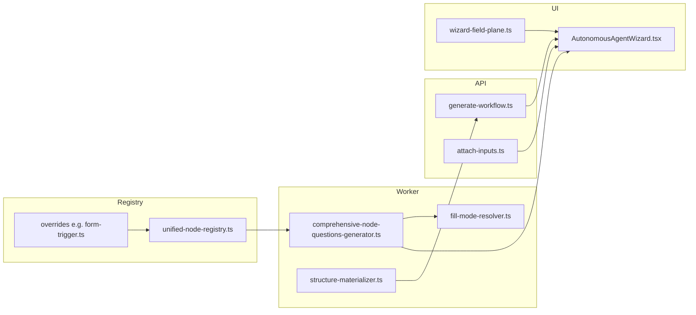

# Field ownership and AI fill-mode — analysis reference

This document implements the **Universal field ownership and AI fill-mode analysis plan**: a single map from registry definitions through worker question payloads to wizard UI behavior, plus pipeline semantics for empty vs filled values. Use it when debugging “AI prefilled”, disabled toggles, or mismatches between generation and the Field Ownership step.

---

## 1. Architecture contract

**Per-field behavior is decided in the unified node registry (including overrides), not in the React wizard.**

The wizard reads:

- `fillMode.default` → initial **You / AI (build) / AI (runtime)** selection when `config._fillMode[field]` is absent
- `fillMode.supportsBuildtimeAI` / `supportsRuntimeAI` → whether **AI (build)** / **AI (runtime)** buttons are enabled
- `ownership` → `structural` | `value` | `credential` (structural **does not** mean “vault secret”)
- `config._fillMode[field]` → user/wizard override, resolved with [`fill-mode-resolver.ts`](../src/core/utils/fill-mode-resolver.ts)
- Stored field values → badges (`aiFilledAtBuildTime`, `aiBuildTimePending`, `aiUsesRuntime`) via [`comprehensive-node-questions-generator.ts`](../src/services/ai/comprehensive-node-questions-generator.ts)

---

## 2. Phase 1 — Registry source of truth

### 2.1 How to audit any node type

1. Open [`unified-node-registry.ts`](../src/core/registry/unified-node-registry.ts) and the node’s conversion path from the node library.
2. Check [`unified-node-registry-overrides.ts`](../src/core/registry/unified-node-registry-overrides.ts) for an override (e.g. `form_trigger` → [`overrides/form-trigger.ts`](../src/core/registry/overrides/form-trigger.ts)).
3. For each `inputSchema` field, record: `fillMode.default`, `supportsBuildtimeAI`, `supportsRuntimeAI`, `ownership`, `credentialTogglePolicy` (if any).

### 2.2 `form_trigger` — complete field table

| Field | `fillMode.default` | Build-time AI | Runtime AI | `ownership` | Notes |
|-------|-------------------|---------------|------------|-------------|--------|
| `formTitle` | `buildtime_ai_once` | yes | no | structural | |
| `fields` | `buildtime_ai_once` | yes | no | structural | `role: raw_json` |
| `formDescription` | `buildtime_ai_once` | yes | no | value | |
| `submitButtonText` | `buildtime_ai_once` | yes | no | value | |
| `successMessage` | `buildtime_ai_once` | yes | no | value | |
| `allowMultipleSubmissions` | `manual_static` | **no** | **no** | structural | Manual-only by design |
| `requireAuthentication` | `manual_static` | **no** | **no** | structural | Manual-only by design |
| `captcha` | `manual_static` | **no** | **no** | structural | Manual-only by design |

Source: [`worker/src/core/registry/overrides/form-trigger.ts`](../src/core/registry/overrides/form-trigger.ts).

**Implication:** After “AI build”, boolean toggles can still show **You** with both AI buttons disabled — that matches the registry, not a credentials bug.

---

## 3. Phase 2 — Question payload (`ComprehensiveNodeQuestion`)

### 3.1 Copying registry metadata onto questions

During generation, for each question whose `fieldName` exists in `inputSchema`:

- `fillModeDefault`, `supportsRuntimeAI`, `supportsBuildtimeAI` are set from `fieldDef.fillMode` (with `!== false` for supports flags where applicable).
- See loop in `generateComprehensiveNodeQuestions` in [`comprehensive-node-questions-generator.ts`](../src/services/ai/comprehensive-node-questions-generator.ts) (~lines 387–407).

### 3.2 Ensuring every schema field has a row

`addMissingInputSchemaQuestionsForOwnership` adds missing keys with the same `fillMode` / `ownership` from the registry (~lines 113–154).

### 3.3 Annotations for wizard UX

`annotateQuestionsForOwnershipUi` (~lines 193–293):

- **Credentials:** locked until unlock policy allows; sets `ownershipUiMode`, `ownershipLockReason`, `isUnlockableCredential`.
- **Effective mode:** `resolveEffectiveFieldFillMode(fieldName, inputSchema, config)` merges `config._fillMode[field]` with schema default, then applies `coerceFieldFillModeByPolicy`.
- **`runtime_ai`:** sets `aiUsesRuntime`; early return.
- **`buildtime_ai_once`:** non-empty value → `aiFilledAtBuildTime`; empty → `aiBuildTimePending`.
- Exposes `effectiveFillMode` on the question object for debugging.

`attachDefaultValuesFromConfig` supplies `defaultValue` from live node config when non-empty.

### 3.4 Regression tests

[`worker/src/services/ai/__tests__/comprehensive-node-questions-ownership.test.ts`](../src/services/ai/__tests__/comprehensive-node-questions-ownership.test.ts) — runtime AI selectable + flags, credentials unlock, `aiBuildTimePending` for empty `fields` with `buildtime_ai_once`, etc.

---

## 4. Phase 3 — Wizard UI rules

File: [`ctrl_checks/src/components/workflow/AutonomousAgentWizard.tsx`](../../ctrl_checks/src/components/workflow/AutonomousAgentWizard.tsx).

| Rule | Implementation |
|------|----------------|
| Disable **You** | Only when row is `locked` (vault credential without unlock). |
| Disable **AI (build)** | `locked \|\| question.supportsBuildtimeAI === false` |
| Disable **AI (runtime)** | `locked \|\| question.supportsRuntimeAI === false` |
| Effective selected mode | `resolveWizardFieldFillMode(fillModeValues[key], question.fillModeDefault)` — `manual_static` → **You** highlighted. |

Helper copy: [`ctrl_checks/src/lib/wizard-field-plane.ts`](../../ctrl_checks/src/lib/wizard-field-plane.ts) — `explainWizardOwnershipRow`:

- Runtime disabled **and** build enabled → *“AI at runtime isn’t available… use AI (build) or You.”*
- Runtime disabled **and** build disabled → `no_runtime_ai`: *“AI runtime is not supported for this field.”*

Synthetic credential rows copy `aiFilledAtBuildTime`, `aiUsesRuntime`, `aiBuildTimePending` from the base question when present (same wizard file, synth row construction).

---

## 5. Phase 4 — Pipeline: effective mode, materialization, API response

### 5.1 `resolveEffectiveFieldFillMode` and coercion

[`fill-mode-resolver.ts`](../src/core/utils/fill-mode-resolver.ts):

1. If `config._fillMode[fieldName]` is a valid enum, use it; else use `inputSchema[field].fillMode.default`.
2. `coerceFieldFillModeByPolicy`:
   - Credential fields with locked policy → force `manual_static` unless unlocked.
   - `runtime_ai` when `supportsRuntimeAI === false` → fall back to `fillMode.default` (or `manual_static` if default was runtime).
   - `buildtime_ai_once` when `supportsBuildtimeAI === false` → same pattern for build-time.

So the wizard cannot persist an invalid mode once attach-inputs runs; attach-inputs also applies coercion (see below).

### 5.2 Structural materialization

[`structure-materializer.ts`](../src/services/ai/structure-materializer.ts) — `materializeStructuralFields`:

- Walks **structural** ownership fields; fills missing values from intent derivation, schema default, or `structuralFallback` (e.g. `[]` for arrays).
- For **structural** fields, coerces `_fillMode[field]` from `runtime_ai` → `buildtime_ai_once`.
- Back-fills missing `_fillMode` entries from `buildEffectiveFillModes`.

**Implementation note:** `deriveStructuralValueFromIntent` and the `fields` normalization pass treat **`form` and `form_trigger`** the same (`isFormLikeNodeType` in [`structure-materializer.ts`](../src/services/ai/structure-materializer.ts)), so build-time / materialization can populate `form_trigger.fields` from workflow intent metadata like the Form node.

### 5.3 Generate-workflow response path

[`generate-workflow.ts`](../src/api/generate-workflow.ts):

- `materializeThenSanitizeForClientResponse` runs `materializeStructuralFields` then `sanitizeRuntimeInputsForResponse`.
- `sanitizeRuntimeInputsForResponse`: for each field, if effective mode is **`runtime_ai`**, clears values to enforce “empty until runtime”; modes **`manual_static`** and **`buildtime_ai_once`** are left as-is.

### 5.4 Attach-inputs

[`attach-inputs.ts`](../src/api/attach-inputs.ts):

- Applies `coerceFieldFillModeByPolicy` when persisting `mode_<nodeId>_<field>` from the wizard; logs coercions in diagnostics.
- `collectEffectiveFillModesForWizard` reads `config._fillMode` back for the client.

---

## 6. Phase 5 — Graph / orchestration (orthogonal to ownership UI)

When debugging **400 / non-existent node / duplicate execution order** issues, use the unified graph orchestrator and edge reconciliation — **not** the Field Ownership toggles.

[`edge-reconciliation-engine.ts`](../src/core/orchestration/edge-reconciliation-engine.ts) **STEP 7**: before wiring `lastNonTerminal → log_output`, checks `existingIncoming` to `log_output`; if the log already has incoming edge(s), skips adding another edge to avoid illegal double outgoing edges from non-branching nodes and related split-ID fallout.

---

## 7. Field → UI decision matrix (quick reference)

| Registry / effective mode | `supportsBuildtimeAI` | `supportsRuntimeAI` | Typical UI |
|---------------------------|------------------------|---------------------|------------|
| `manual_static` | false | false | **You** only; both AI disabled; short “runtime not supported” helper |
| `manual_static` | true | false | **You** default; **AI (build)** enabled; runtime disabled; longer helper |
| `buildtime_ai_once` | true | false | AI (build) available; badge prefilled vs pending vs empty from value |
| `runtime_ai` | * | false | **AI (runtime)** when supported; snapshot often empty after sanitize; `aiUsesRuntime` badge |
| Credential locked | * | * | Locked row; Credentials step / unlock |

**Badges (worker annotations):**

| Condition | Flag |
|-----------|------|
| Effective `runtime_ai` | `aiUsesRuntime` |
| Effective `buildtime_ai_once` + empty value | `aiBuildTimePending` |
| Effective `buildtime_ai_once` + non-empty value | `aiFilledAtBuildTime` |

---

## 8. Verification checklist (when investigating a screenshot)

1. Identify **node type** and **field name**.
2. Look up the row in the **registry table** (Phase 2.2 or your own audit).
3. If **AI (build)** is disabled → check `supportsBuildtimeAI === false` in registry.
4. If **You** is selected → check `fillMode.default` and `config._fillMode[field]`.
5. If value is empty but mode is build-time AI → trace **materializer** + **intent text** + node type (`form` vs `form_trigger` for `fields`).
6. If **runtime** feels “missing” in API JSON → check **sanitizeRuntimeInputsForResponse**.
7. Do **not** assume **structural** means credential — cross-check `isCredentialOwnership` / category.

---

## 9. Optional product change (registry-level)

Allowing **AI (build)** on `form_trigger` booleans (`allowMultipleSubmissions`, etc.) requires changing [`overrides/form-trigger.ts`](../src/core/registry/overrides/form-trigger.ts) (`fillMode` + tests), not wizard-only toggles — consistent with permanent core architecture (single source of truth in registry).
