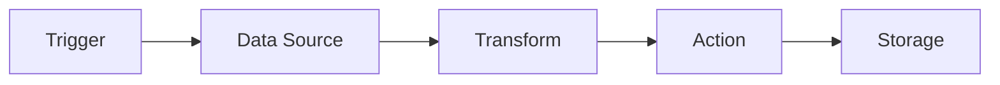
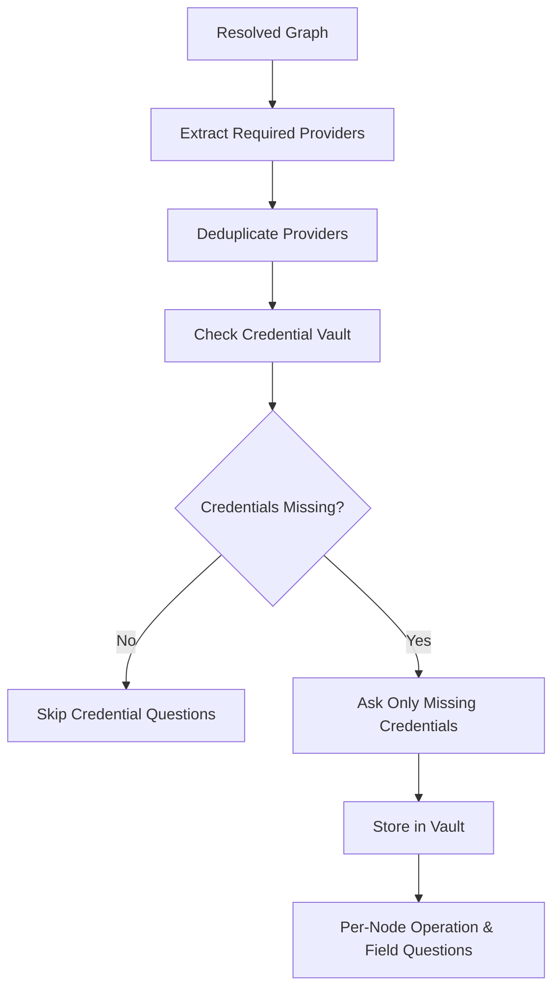
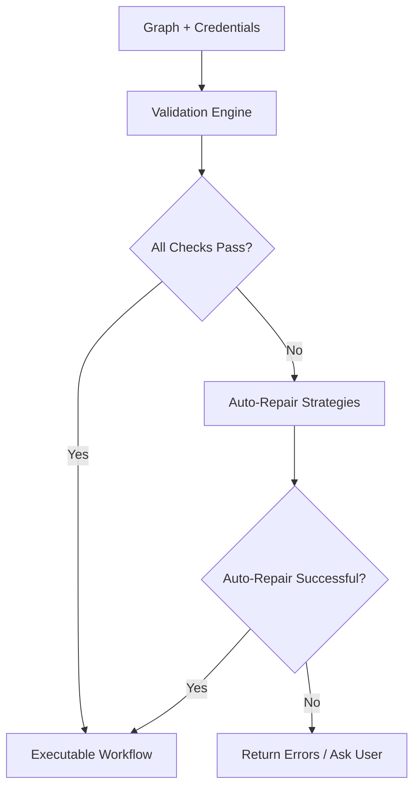
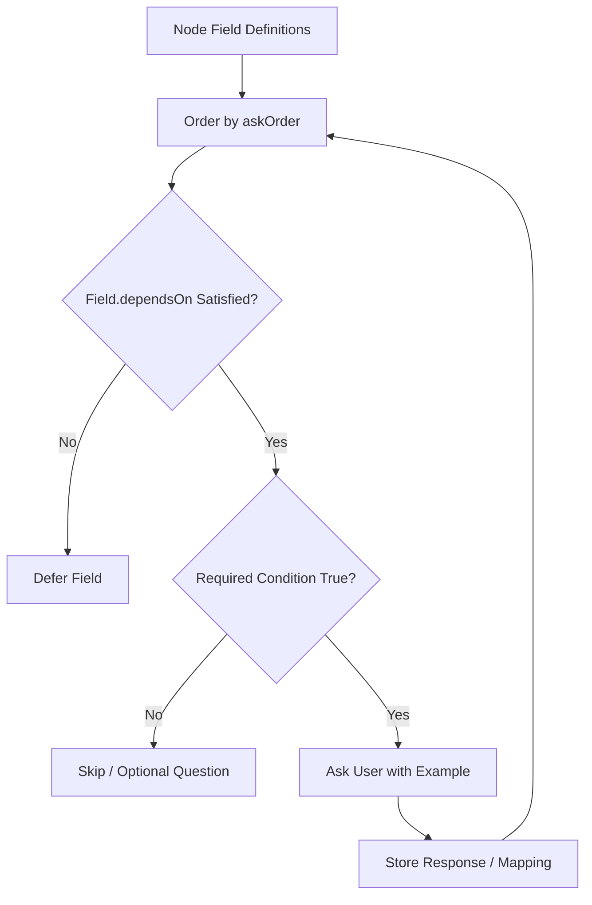
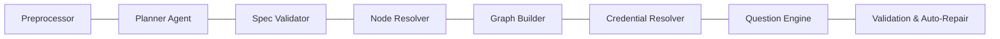
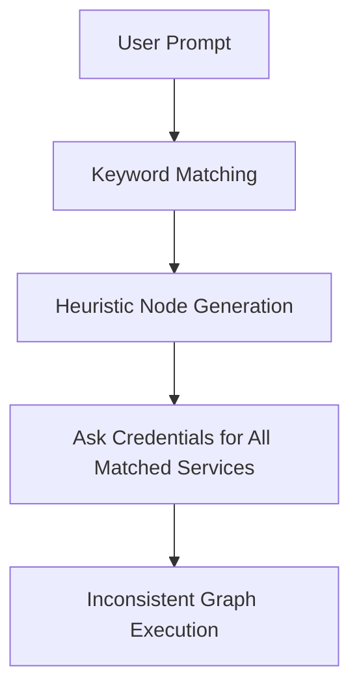

## Smart Planner–Driven Workflow Orchestration System  
### Technical Architecture Guide (Enterprise Edition)

---

## 1. Executive Summary

The **Smart Planner–Driven Workflow Orchestration System** introduces a dedicated **Planner Layer** between user prompt interpretation and workflow graph generation.

This architecture transforms the system from a keyword-based node generator into an **intent-aware workflow compiler**, ensuring:

- **Minimal node creation**
- **Deterministic behavior**
- **Reduced ambiguity**
- **Strict separation of AI reasoning and system execution**
- **Enterprise-grade scalability and reliability**

---

## 2. Problem Statement

Traditional workflow builders often:

- **Over-generate nodes** (e.g., adding Gmail when unnecessary)
- **Rely on keyword detection instead of intent reasoning**
- **Mix AI inference with execution logic**
- **Produce inconsistent graphs for similar prompts**
- **Ask irrelevant credential/config questions**

### Example Failure Case

**Prompt**

> Extract the Gmail in sheet and create contact in HubSpot.

**Typical keyword-based behavior**

- Detects the word **“Gmail”**
- Adds a **Gmail node** incorrectly
- Asks for **Gmail credentials** unnecessarily

**Result**

- False-positive integration
- Confusing UX
- Increased friction

---

## 3. Architectural Vision

### Core Philosophy

| Principle              | Meaning                                  |
|------------------------|------------------------------------------|
| **AI decides WHAT**    | Planner extracts user intent             |
| **System decides HOW** | Resolver builds workflow deterministically |
| **No keyword-based creation** | Nodes only from structured spec      |
| **Separation of concerns**    | Intelligence and execution isolated  |

---

## 4. High-Level System Flow

**End-to-End Runtime Flow**

```mermaid
flowchart TD
    A[User Prompt] --> B[Preprocessing Layer]
    B --> C[Planner Agent<br/>(Intent & Role Extraction)]
    C --> D[Structured Spec JSON]
    D --> E[Deterministic Node Resolver]
    E --> F[Graph Builder]
    F --> G[Credential & Config Layer]
    G --> H[Validation & Auto-Repair]
    H --> I[Executable Workflow]
```

**Key Separation**

- **AI decides WHAT**: `Planner Agent` outputs a structured **intent spec** (JSON).
- **System decides HOW**: `Node Resolver` + `Graph Builder` produce a **deterministic workflow graph**.

---

## 5. Layer-by-Layer Architecture

### 5.1 Preprocessing Layer

**Objective**

Normalize user input before any AI reasoning.

**Responsibilities**

- **Normalize casing**
- **Expand abbreviations**
  - `gsheet` → `Google Sheets`
  - `hs` → `HubSpot`
- **Remove filler words**
- **Standardize verbs**
- **Clean punctuation noise**

**Input**

- Raw user prompt (unstructured text)

**Output**

- Clean, normalized prompt string

**Example**

- Input:  
  `hey can u pls get gsheet emails n create contact in hubspot`
- Output:  
  `get emails from Google Sheets and create contact in HubSpot`

This ensures the Planner operates on **normalized**, structured input.

---

### 5.2 Planner Agent (Core Intelligence Layer)

This is the **only AI-powered reasoning layer**.

**Responsibilities**

- Detect **trigger type**
- Extract **main objective**
- Identify **entities**
- Classify **services by role**
- Detect **ambiguity**
- Produce **structured deterministic spec** (JSON)

---

## 6. Planner Logic Breakdown

### 6.1 Intent Extraction – Trigger Detection

| Phrase         | Trigger Type |
|----------------|-------------|
| **When / On**  | Event-based |
| **Every day**  | Schedule    |
| **At 9 AM**    | Schedule    |
| **Manually**   | Manual      |
| **Webhook**    | Webhook     |

---

### 6.2 Action Verb Detection

Common verbs:

- `create`
- `update`
- `send`
- `fetch`
- `read`
- `store`
- `append`
- `log`
- `delete`

---

### 6.3 Entity Detection

Example entities:

- `contact`
- `email`
- `message`
- `row`
- `deal`
- `file`

---

### 6.4 Phrase Classification Rules

| Phrase Pattern           | Meaning             |
|--------------------------|--------------------|
| **WHEN / ON**            | Trigger            |
| **GET / READ / FETCH FROM** | Data Source     |
| **CREATE / UPDATE / SEND IN** | Action        |
| **STORE / APPEND / LOG TO** | Storage         |
| **IN / STORED IN** (contextual) | Existing storage (not source) |

---

### 6.5 Role Assignment Rules

For each detected service:

| Condition                              | Assigned Role     |
|----------------------------------------|-------------------|
| Used with read/list verbs             | `data_source`     |
| Used with create/update/send verbs    | `action`          |
| Used with append/store/log verbs      | `storage`         |
| Appears only in contextual phrasing   | `mentioned_only`  |

---

## 7. Structured Planner Output

The Planner **must** return a deterministic JSON spec.

### 7.1 Example Output

```json
{
  "trigger": "manual",
  "data_sources": ["google_sheets"],
  "actions": ["hubspot.create_contact"],
  "storage": [],
  "transformations": ["loop"],
  "mentioned_only": ["google_gmail"],
  "entities": ["contact"],
  "fields": ["email", "first_name", "last_name"],
  "clarifications": []
}
```

### 7.2 Spec Requirements

- **No execution logic**
- **No node names**
- **No graph structure**
- **Only intent-level abstraction**

---

## 8. Ambiguity Handling

If the Planner **cannot determine intent clearly**, it must generate **clarifications** instead of guessing.

### 8.1 Example

**Prompt**

> Get emails and store in CRM

**Ambiguity**

- Source is unclear:
  - Gmail?
  - Google Sheets?
  - Another system?

**Planner Output**

```json
"clarifications": [
  "Should we read emails directly from Gmail, or from Google Sheets, or from another source?"
]
```

### 8.2 Interactive Mode

1. Planner generates clarifying questions.
2. System asks user for clarification.
3. User answers.
4. Planner updates spec and continues resolution.

**Rule**: **No guessing allowed** when intent is ambiguous.

**Ambiguity Handling Flow**

```mermaid
flowchart TD
    A[Clean Prompt] --> B[Planner Analysis]
    B --> C{Is Intent Clear?}
    C -->|Yes| D[Return Final Spec<br/>clarifications: []]
    C -->|No| E[Generate Clarification Questions]
    E --> F[Send Questions to User]
    F --> G[User Responses]
    G --> H[Update Intent Understanding]
    H --> I[Return Final Spec<br/>with resolved clarifications]
```

---

## 9. Deterministic Node Resolution Layer

This layer contains **no AI**.

**Goal**: Map the **structured spec** to **concrete nodes** deterministically.

### 9.1 Mapping Rules

| Spec Component   | Node Created                           |
|------------------|----------------------------------------|
| `trigger`        | Trigger node                           |
| `data_sources`   | Connector node (read operation)        |
| `transformations`| Logic node                             |
| `actions`        | Connector node (write operation)       |
| `storage`        | Storage node                           |

### 9.2 Example Mapping

**Spec**

```json
{
  "trigger": "manual",
  "data_sources": ["google_sheets"],
  "actions": ["hubspot.create_contact"],
  "transformations": ["loop"]
}
```

**Generated Graph**

```mermaid
flowchart TD
    A[Manual Trigger] --> B[Google Sheets<br/>(read_rows)]
    B --> C[Loop]
    C --> D[HubSpot<br/>(create_contact)]
```

- **No Gmail node created.**

---

## 10. Graph Construction Rules

### 10.1 Valid Flow Pattern



### 10.2 Connection Constraints

- **No orphan nodes**
- **All actions must receive input**
- **Loop** required when:
  - Multiple records from a data source
  - Single-record action per item
- **Conditional logic** requires `If` or `Switch` node
- **Merge** required for dual input streams

---

## 11. Credential Resolution Flow

Credentials are requested **only after** node resolution.

### 11.1 Process



### 11.2 Question Order

For each node:

1. **Credentials** (if missing)
2. **Operation**
3. **Target identifier** (ID / URL / channel / list / pipeline)
4. **Required payload fields**
5. **Optional settings**

---

## 12. Validation & Auto-Repair Layer

Before execution, the system must **validate** and, where possible, **auto-repair** the graph.

### 12.1 Validation Checks

- Required fields present
- Proper node connections
- Type compatibility between nodes
- Credentials resolvable
- No `mentioned_only` nodes included in graph

### 12.2 Auto-Repair Examples

| Issue                               | Auto-Repair Action        |
|-------------------------------------|---------------------------|
| Multiple rows but no loop           | Add loop node            |
| Field mismatch                      | Insert Set/Map node      |
| Dual input                          | Insert Merge node        |
| Missing explicit mapping            | Auto-map by name similarity |

### 12.3 Validation Flow



---

## 13. Field-Level Question Engine

Each field for each node defines:

- `askOrder`
- `dependsOn`
- `required condition`
- `example`

This ensures **structured** and **sequential** questioning.

### 13.1 Question Engine Flow



---

## 14. Solving Gmail Over-Generation

**Prompt**

> Extract the Gmail in sheet and create contact in HubSpot.

### 14.1 Planner Detection

- **Data source** → `Google Sheets`
- **Gmail** → contextual origin (emails originally from Gmail)  
  - Classified as `mentioned_only`
- **Action** → `HubSpot create contact`

**Resulting Spec**

```json
{
  "trigger": "manual",
  "data_sources": ["google_sheets"],
  "actions": ["hubspot.create_contact"],
  "storage": [],
  "transformations": ["loop"],
  "mentioned_only": ["google_gmail"],
  "entities": ["contact"],
  "fields": ["email", "first_name", "last_name"],
  "clarifications": []
}
```

### 14.2 Result

- **No Gmail node created.**
- **No Gmail credentials requested.**

**Flow**

```mermaid
flowchart TD
    A[Manual Trigger] --> B[Google Sheets<br/>(read_rows)]
    B --> C[Loop Records]
    C --> D[HubSpot<br/>(create_contact)]
```

---

## 15. Enterprise-Grade Component Separation

Each module operates **independently**.

### 15.1 Components

- **Preprocessor**
- **Planner Agent**
- **Spec Validator**
- **Node Resolver**
- **Graph Builder**
- **Credential Resolver**
- **Question Engine**
- **Validation & Auto-Repair Engine**

### 15.2 Separation Benefits

- Horizontal scaling per component
- Independent testing and deployment
- Pluggable AI upgrades (Planner only)
- Deterministic backend logic for execution

**Component View**



---

## 16. System Transformation Impact

### 16.1 Before – Keyword-Based Generation



Characteristics:

- Keyword-based generation
- Over-creation of nodes
- Inconsistent results
- Credential spam
- Fragile execution

---

### 16.2 After – Planner-Driven Compilation

```mermaid
flowchart TD
    A[User Prompt] --> B[Preprocessing]
    B --> C[Planner Agent<br/>(Intent Spec)]
    C --> D[Deterministic Node Resolver]
    D --> E[Graph Builder]
    E --> F[Credential & Question Engine]
    F --> G[Validation & Auto-Repair]
    G --> H[Predictable Execution]
```

Characteristics:

- Intent-driven planning
- Deterministic compilation
- Minimal node graph
- Reduced ambiguity
- Enterprise reliability

---

## 17. Final Outcome

This architecture upgrades the system from:

- ❌ **A reactive, keyword-based node generator**

To:

- ✅ **A deterministic workflow compiler powered by AI intent extraction**

It ensures:

- **Clean graphs**
- **Predictable behavior**
- **Scalable design**
- **Strict separation of intelligence and execution**
- **Enterprise-grade robustness**

